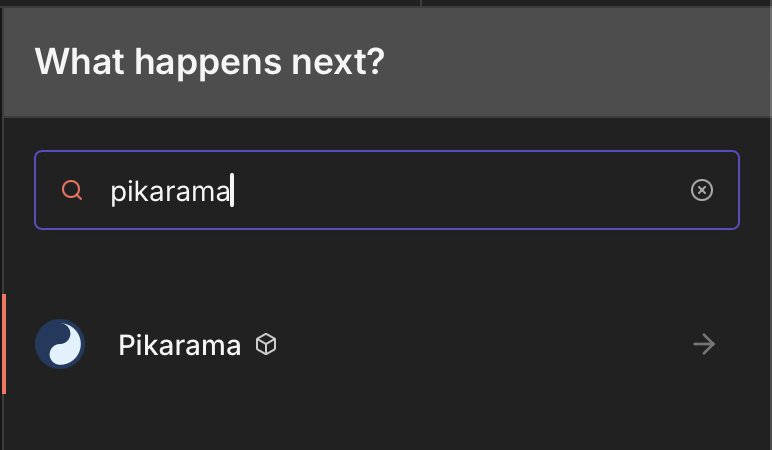
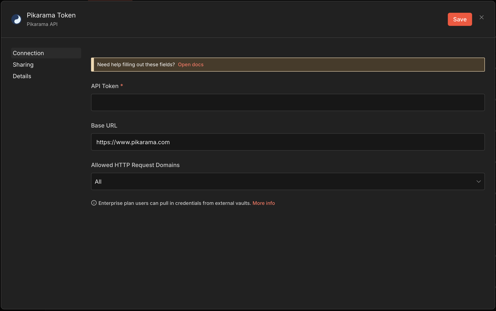
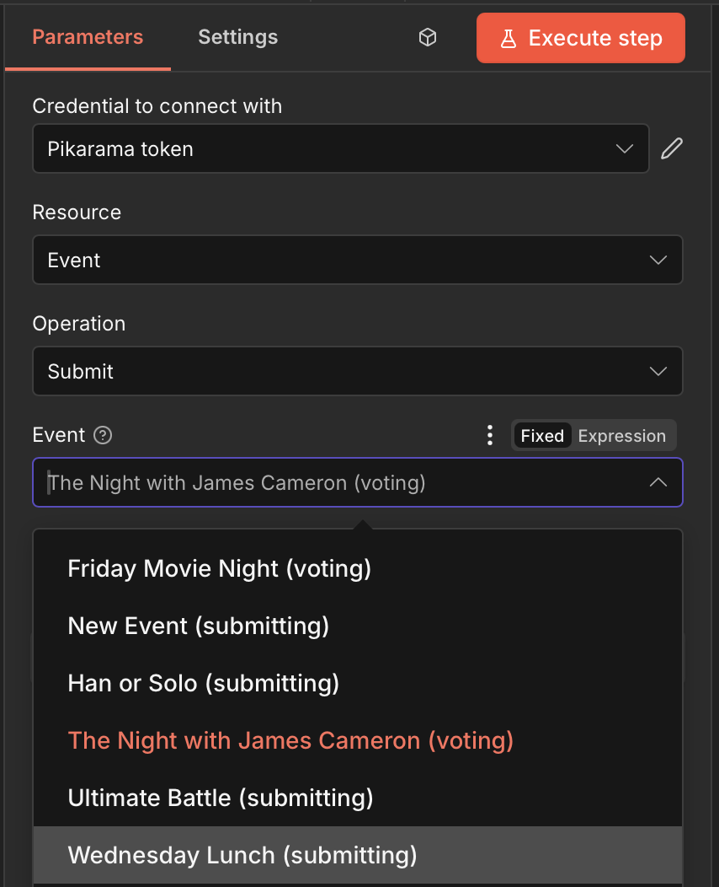
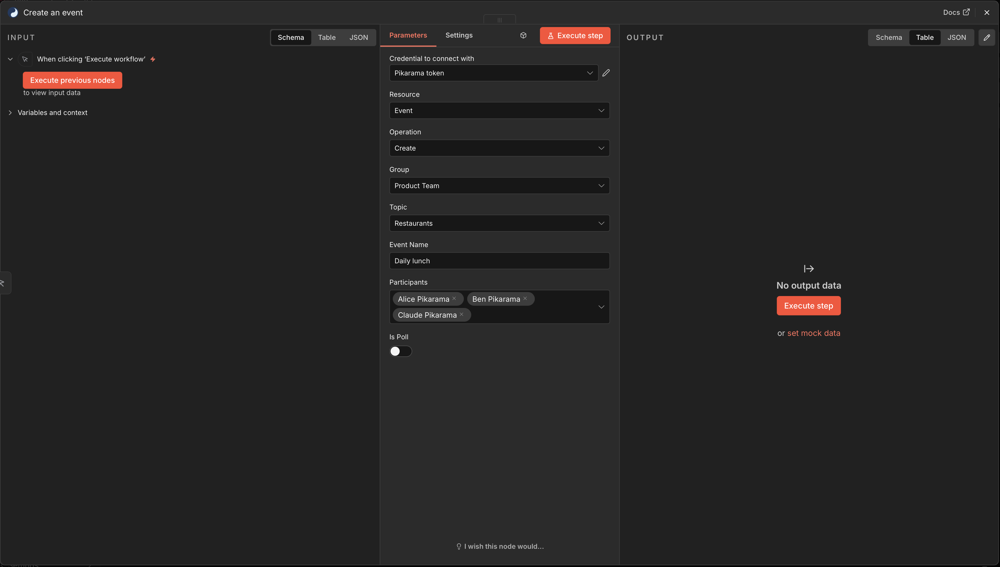
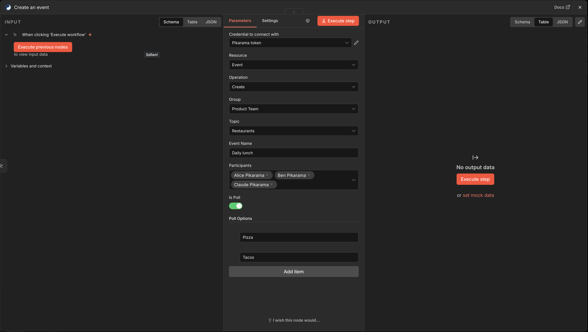

# n8n-nodes-pikarama

This is an n8n community node for [Pikarama](https://www.pikarama.com) — a fair group decision-making app with karma-weighted voting.

[n8n](https://n8n.io/) is a [fair-code licensed](https://docs.n8n.io/reference/license/) workflow automation platform.

## Installation

Follow the [installation guide](https://docs.n8n.io/integrations/community-nodes/installation/) in the n8n community nodes documentation.

**npm package name:** `n8n-nodes-pikarama`

## Credentials

To use this node, you need a Pikarama API token:

1. Log in to [Pikarama](https://www.pikarama.com)
2. Go to **Settings** (gear icon)
3. Under **API Tokens**, click **Generate New Token**
4. Copy the token (starts with `pk_`)
5. In n8n, create new credentials:
   - **API Token:** paste your `pk_` token
   - **Base URL:** `https://www.pikarama.com`

## Operations

### Event

| Operation | Description |
|-----------|-------------|
| **Create** | Create a new event or poll. Select group, topic, participants, and optionally create as poll with predefined options. |
| **Get** | Get details of a specific event |
| **Get Many** | List events with status filters |
| **Submit** | Submit one or more picks to an event (up to 3) |
| **Vote** | Cast votes on submissions |
| **Advance** | Advance event to next phase |
| **Cancel** | Cancel an event |

### Group

| Operation | Description |
|-----------|-------------|
| **Get** | Get group details |
| **Get Many** | List all your groups |
| **Get Topics** | List topics in a group |
| **Get Members** | List members of a group |

### Karma

| Operation | Description |
|-----------|-------------|
| **Get** | Get karma statistics, optionally filtered by group |

## Features

### Dynamic Dropdowns

All selectors load data dynamically from your Pikarama account:
- **Groups** — Your groups
- **Topics** — Topics within selected group
- **Events** — Active events with status indicator
- **Participants** — Group members for event creation
- **Submissions** — Available picks for voting

### Create Events with Participants

Select specific participants or leave empty to include all group members:

### Poll Creation

Create polls with predefined options — no karma changes, just simple voting:

### Multi-Submit Support

Submit multiple picks at once (up to 3 per event).

## Example: Create a Weekly Lunch Poll

1. **Schedule Trigger** → Every Monday at 9 AM
2. **Pikarama Node**:
   - Resource: Event
   - Operation: Create
   - Group: Select your team
   - Topic: Select "Lunch" topic
   - Event Name: "Friday Lunch Spot?"
   - Is Poll: ✅
   - Poll Options: "Pizza", "Sushi", "Thai", "Burgers"

## Compatibility

- Tested with n8n version 2.9.x
- Requires Pikarama API v1

## Resources

- [Pikarama Website](https://www.pikarama.com)
- [Pikarama API Documentation](https://www.pikarama.com/api-docs)
- [n8n Community Nodes Documentation](https://docs.n8n.io/integrations/community-nodes/)

## License

[MIT](LICENSE)
