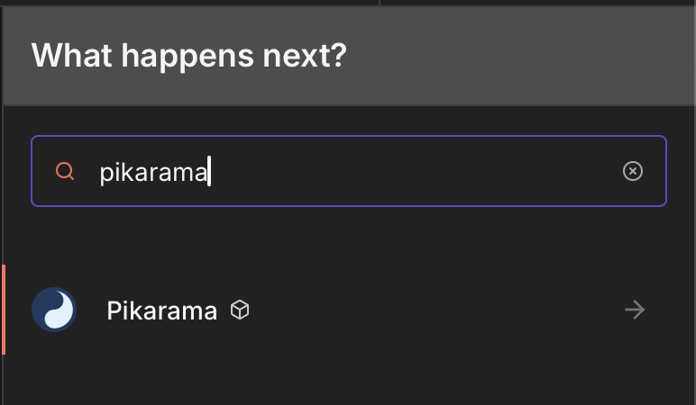
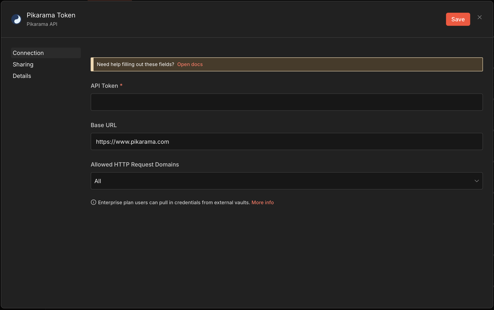
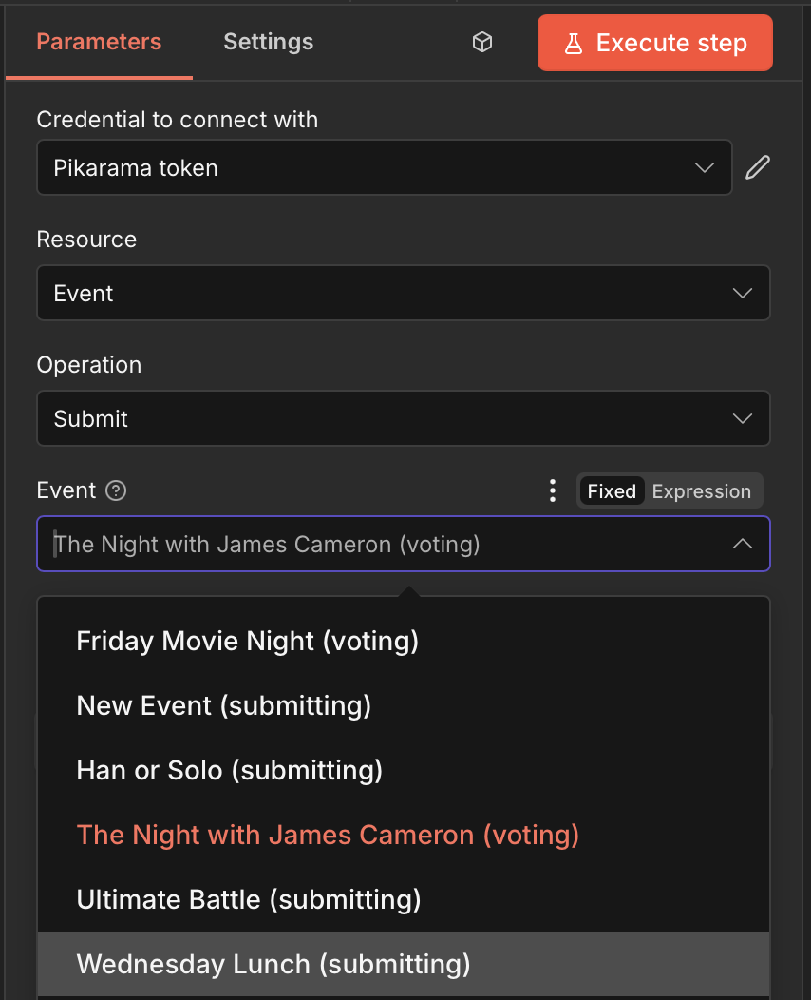
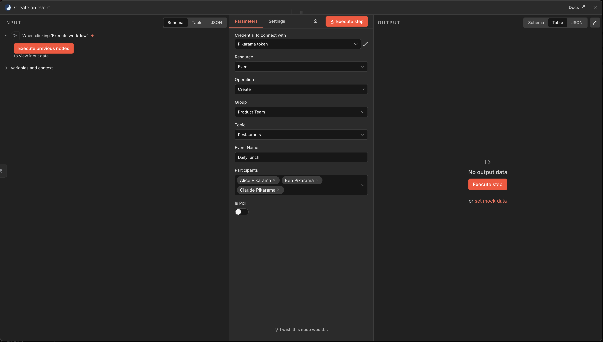
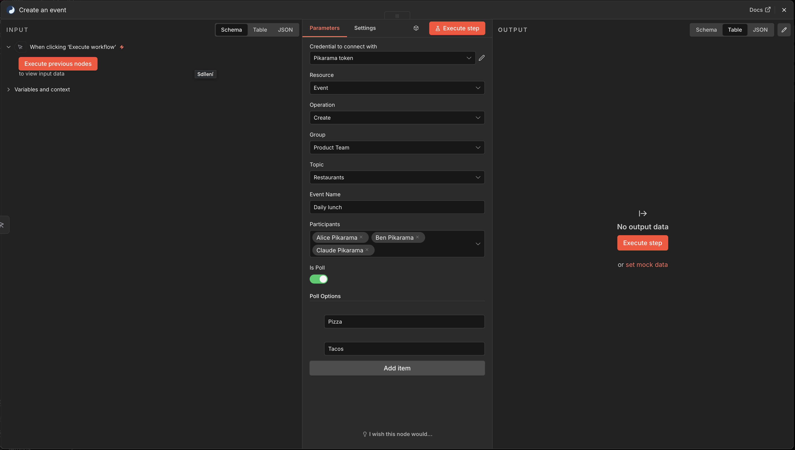

# n8n-nodes-pikarama

This is an n8n community node for [Pikarama](https://www.pikarama.com) — a fair group decision-making app with karma-weighted voting.

[n8n](https://n8n.io/) is a [fair-code licensed](https://docs.n8n.io/reference/license/) workflow automation platform.



## Installation

Follow the [installation guide](https://docs.n8n.io/integrations/community-nodes/installation/) in the n8n community nodes documentation.

**npm package name:** `n8n-nodes-pikarama`

## Credentials

To use this node, you need a Pikarama API token:

1. Log in to [Pikarama](https://www.pikarama.com)
2. Go to **Settings** (gear icon)
3. Under **API Tokens**, click **Generate New Token**
4. Copy the token (starts with `pk_`)
5. In n8n, create new credentials:
   - **API Token:** paste your `pk_` token
   - **Base URL:** `https://www.pikarama.com`



## Operations

### Event

| Operation | Description |
|-----------|-------------|
| **Create** | Create a new event or poll. Select group, topic, participants, and optionally create as poll with predefined options. |
| **Get** | Get details of a specific event |
| **Get Many** | List events with status filters |
| **Submit** | Submit one or more picks to an event (up to 3) |
| **Vote** | Cast votes on submissions |
| **Advance** | Advance event to next phase |
| **Cancel** | Cancel an event |

### Group

| Operation | Description |
|-----------|-------------|
| **Get** | Get group details |
| **Get Many** | List all your groups |
| **Get Topics** | List topics in a group |
| **Get Members** | List members of a group |

### Karma

| Operation | Description |
|-----------|-------------|
| **Get** | Get karma statistics, optionally filtered by group |

### User

| Operation | Description |
|-----------|-------------|
| **Get Current** | Get info about the authenticated user (verify API token ownership) |

## Pikarama Trigger

The **Pikarama Trigger** node lets you receive real-time webhook events from Pikarama. When you activate a workflow, it automatically registers a webhook with Pikarama. When deactivated, it removes the webhook.

### Events

| Event | Description |
|-------|-------------|
| **Event Created** | Fires when a new event or poll is created |
| **Event Closed** | Fires when an event is completed (winner chosen) |
| **Vote Cast** | Fires when someone votes |
| **Submission Added** | Fires when someone submits a pick |

### Filter by Groups

Optionally filter events to specific groups:

1. Enable **Filter by Groups**
2. Select one or more groups from the dropdown
3. Only events from those groups will trigger the workflow

Leave empty to receive events from all your groups.

### Webhook Signature Verification

All webhook payloads are signed with HMAC-SHA256. The trigger node automatically verifies the `X-Pikarama-Signature` header to ensure payloads are authentic.

### Recurring Event Fields

When an event is created by a recurring schedule (Plus/Pro plans), the payload includes additional fields:

```json
{
  "event": "event.created",
  "data": {
    "event": {
      "id": "abc123",
      "name": "Friday Movie Night",
      "status": "submitting",
      "is_recurring": true,
      "schedule_id": "sch-456",
      "recurrence_cron": "0 18 * * 5",
      "event_time": "2026-03-07T18:00:00Z",
      "submission_deadline": "2026-03-07T17:00:00Z",
      "voting_deadline": "2026-03-07T18:00:00Z"
    }
  }
}
```

Use `is_recurring` to detect scheduled events vs manually created ones.

### Example: Create Calendar Event from Recurring Pikarama Event

1. **Pikarama Trigger** → Events: "Event Created"
2. **IF Node** → Condition: `{{ $json.data.event.is_recurring }}` equals `true`
3. **Google Calendar Node**:
   - Summary: `{{ $json.data.event.name }}`
   - Start: `{{ $json.data.event.event_time }}`
   - Description: "Pikarama decision time! Submit your picks."

### Example: Notify Slack When Event Completes

1. **Pikarama Trigger** → Events: "Event Closed"
2. **Slack Node** → Send message: "🎉 Winner: {{ $json.data.winner.title }}"

## Features

### Dynamic Dropdowns

All selectors load data dynamically from your Pikarama account:
- **Groups** — Your groups
- **Topics** — Topics within selected group
- **Events** — Active events with status indicator
- **Participants** — Group members for event creation
- **Submissions** — Available picks for voting



### Create Events with Participants

Select specific participants or leave empty to include all group members:



### Poll Creation

Create polls with predefined options — no karma changes, just simple voting:



### Multi-Submit Support

Submit multiple picks at once (up to 3 per event).

## Example: Create a Weekly Lunch Poll

1. **Schedule Trigger** → Every Monday at 9 AM
2. **Pikarama Node**:
   - Resource: Event
   - Operation: Create
   - Group: Select your team
   - Topic: Select "Lunch" topic
   - Event Name: "Friday Lunch Spot?"
   - Is Poll: ✅
   - Poll Options: "Pizza", "Sushi", "Thai", "Burgers"

## Compatibility

- Tested with n8n version 2.9.x
- Requires Pikarama API v1

## Resources

- [Pikarama Website](https://www.pikarama.com)
- [Pikarama API Documentation](https://www.pikarama.com/api-docs)
- [n8n Community Nodes Documentation](https://docs.n8n.io/integrations/community-nodes/)

## License

[MIT](LICENSE)
